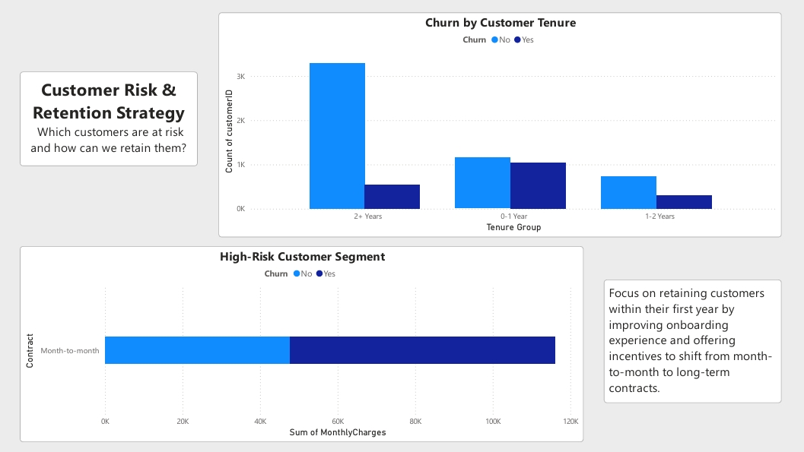
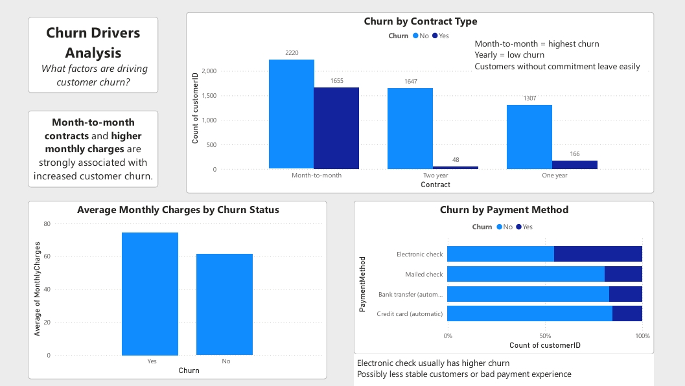
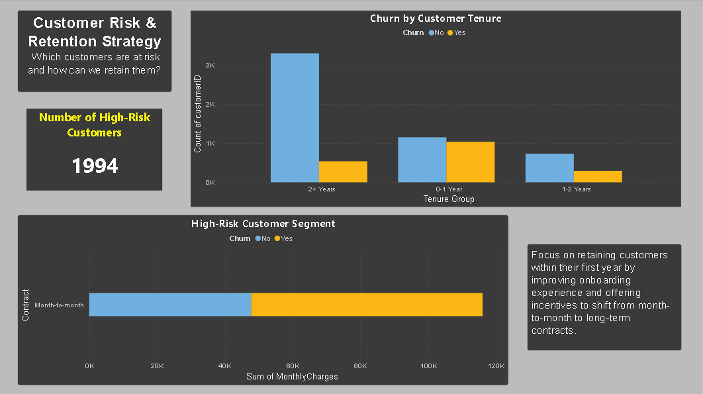

# Telco Customer Churn Analysis (SQL + Python + Power BI)

## Project Overview

This project analyzes customer churn behavior for a telecommunications company using an end-to-end data analytics workflow.

The goal is to identify key drivers of churn, segment high-risk customers, and provide actionable insights to improve customer retention and reduce revenue loss.

The project follows a full analytics pipeline:

**SQL → Python → Power BI**

---

## Dashboard Preview
### Executive Overview

### Churn Drivers

### Customer Risk & Retention

---

## Business Objective

- Understand why customers are leaving
- Identify high-risk customer segments
- Measure financial impact of churn
- Support data-driven retention strategies

---

## Tools & Technologies

- SQL (Data extraction & exploration)
- Python (Pandas, Matplotlib, Seaborn)
- Power BI (Dashboard & visualization)
- Jupyter Notebook

---

## Project Structure

- `sql/` → Data exploration, churn analysis, feature engineering queries  
- `notebooks/` → Python analysis & feature engineering  
- `powerbi/` → Interactive dashboard  
- `data/` → Raw dataset (if included)

---

## Key Analysis Performed

### Churn Overview
- Churn rate calculation
- Churn distribution

### Churn Drivers
- Contract type impact on churn
- Monthly charges vs churn
- Payment method analysis

### Customer Segmentation
- Tenure-based segmentation
- High-risk customer identification

### Business Impact
- Customer Lifetime Value (CLV)
- Estimated revenue loss due to churn

---

## Key Insights

- Month-to-month customers show the highest churn rate
- Higher monthly charges are associated with increased churn risk
- New customers (0–1 year tenure) are most likely to churn
- A high-risk segment was identified based on tenure, contract type, and pricing
- Churn leads to significant recurring revenue loss

---

## Dashboard (Power BI)

The Power BI dashboard includes:

- KPI Overview (Churn Rate, Revenue Loss, Customer Count)
- Churn drivers analysis (Contract, Charges, Payment Method)
- Customer segmentation (Tenure, High-risk groups)

---

## Business Recommendations

- Encourage long-term contracts through incentives
- Improve onboarding experience for new customers
- Review pricing strategy for high-charge plans
- Target high-risk customers with retention campaigns

---

## Key Takeaway

This project demonstrates an end-to-end analytics workflow combining SQL, Python, and Power BI to generate actionable business insights for customer retention strategy.

